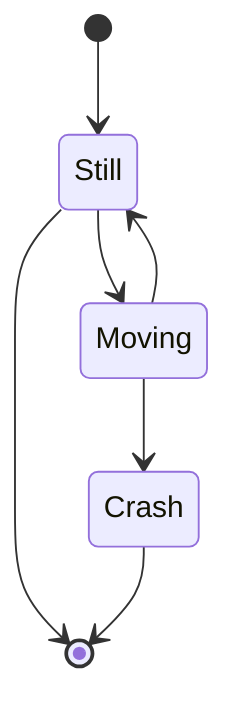

# ⚙️ Robust Hyperparameter Optimization Workshop

**A hands-on guide to building reliable and validated ML optimization workflows.**

This workshop walks you through **data validation with `Pandera` and `Pydantic`**, and **hyperparameter optimization with `Optuna`**, combining the best practices for **trustworthy Machine Learning**.

---

## 🧩 Overview

What you will progressively do:

1. **Enforce configuration integrity and validation** with `Pydantic`.  
2. **Validate your dataframe** using `Pandera` (schema-based data validation).  
3. **Optimize model performance** via Bayesian optimization using `Optuna`.  
4. **Combine all three** to create a robust end-to-end ML optimization workflow.

---

## 📙 Notebooks

The notebooks folder contains the following

| Notebook | Description |
|:--|:--|
| `1.0-analyze-data.ipynb` | Quick EDA |
| `2.2-pydantic-explain.ipynb` | Introduction to `Pydantic` and its validation features |
| `2.2-pandera-explain.ipynb` | Introduction to `Pandera` for tabular data validation |
| `3.1-bayesian-opt-explain.md` | Core principles behind Bayesian optimization |
| `3.2-bayesian-opt-starter.ipynb` | Practical tutorial to get started with `Optuna` |
| `assignment.ipynb` | Final assignment: combine `Pandera`, `Pydantic`, and `Optuna` |
| `1.0-analyze-data.ipynb` | Quick EDA and data exploration |



---

## 🛠️ Installation

We use **[`uv`](https://github.com/astral-sh/uv)** for fast Python environment creation.

```bash
# Clone the repository
git https://github.com/<your-username>/workshop-robust-hyperparam-tuning.git

cd robust-hyperparameter-optimization

# Install dependencies
uv sync
```

> 📦 All dependencies are defined in the `pyproject.toml` file.

---

## 🚀 Quick Start

```bash
# Activate the environment
source .venv/bin/activate  # (on Windows: .venv\Scripts\activate)

# Run an example
python 05_bayesian_optimization_starter/main.py

```

## 🧠 What You’ll Learn

- ✅ How to define and validate ML inputs and configurations  
- 🧪 How to ensure clean data pipelines with schema checks  
- 🔍 How to optimize and visualize hyperparameter tuning results  
- ⚡ How to combine validation and optimization into one robust workflow

---

## 📊 Tech Stack

| Component | Library |
|------------|----------|
| EDA | `summarytools`, `skrub` |
| Data validation | `pandera`, `pydantic` |
| Optimization | `optuna` |
| Modeling | `scikit-learn` |

---

## 🧩 Next Steps

- Extend the search space to new ML models  
- Add advanced `Optuna` samplers or pruners  
- Integrate with MLflow or Weights & Biases for experiment tracking

---

## 👥 Authors

| [](https://www.linkedin.com/in/benjamin-wallyn/) | [](https://www.linkedin.com/in/juanpablousuga/) |
|:--:|:--:|
| [**Benjamin Wallyn**](https://www.linkedin.com/in/benjamin-wallyn/) | [**Juan Pablo Usuga Cadavid**](https://www.linkedin.com/in/jpusugacadavid/)|
