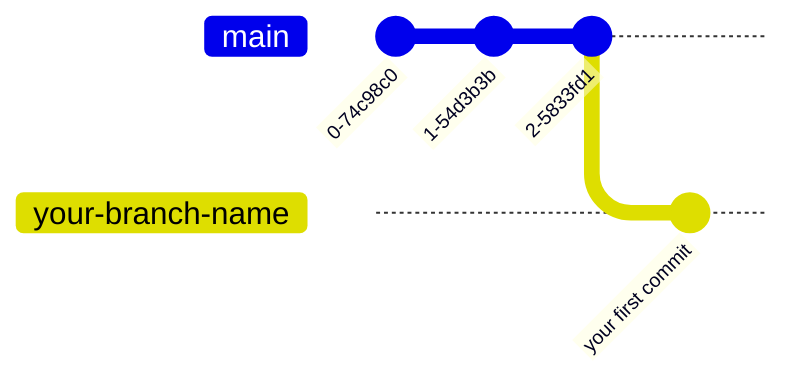
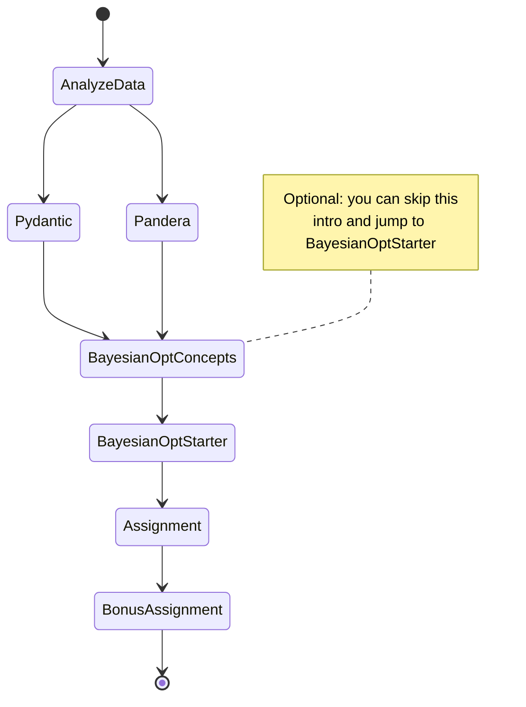

# ⚙️ Robust Hyperparameter Optimization Workshop

**A hands-on guide to building reliable and validated ML optimization workflows.**

This workshop introduces participants to essential MLOps practices, focusing on **automating data quality validation and hyperparameter tuning**. They will learn to use `Pydantic` and `Pandera` to build automated data validation pipelines. The session also covers hyperparameter tuning with Bayesian optimization using the `Optuna` framework, including how to interpret and analyze the results.

---

## 🧩 Overview

What you will progressively learn:

1. **Enforce configuration integrity and validation** with `Pydantic`.  
2. **Validate your dataframe** using `Pandera` (schema-based data validation).  
3. **Optimize model performance** via Bayesian optimization using `Optuna`.  
4. **Combine all three** to create a robust end-to-end ML optimization workflow.

---

## 🚀 Quick setup

```bash
# Clone the repository
git https://github.com/YOUR_USERNAME/workshop-robust-hyperparam-tuning.git

cd workshop-robust-hyperparam-tuning
```

After forking the repository, create a new branch to work on your solutions:

```bash
# Create your branch
git checkout -b your-branch-name
```



---

## 🛠️ Installation

We use **[`uv`](https://github.com/astral-sh/uv)** for the Python environment creation.

```bash
# Create environment
uv venv
# Install dependencies
uv sync
```

> 📦 All dependencies are defined in the `pyproject.toml` file.
---

```bash
# Activate the environment
source .venv/bin/activate  # (on Windows: .venv\Scripts\activate)
```

---

## 📙 Notebooks

The workshop will be done through notebooks. The notebooks folder contains the following elements:

| Notebook | Description |
|:--|:--|
| `1.0-analyze-data.ipynb` | Quick EDA to familiarize with the data|
| `2.1-pydantic-explain.ipynb` | Introduction to `Pydantic` and its validation features |
| `2.2-pandera-explain.ipynb` | Introduction to `Pandera` for tabular data validation |
| `3.1-bayesian-opt-explain.md` | Core principles behind Bayesian optimization |
| `3.2-bayesian-opt-starter.ipynb` | Practical tutorial to get started with `Optuna` |
| `assignment.ipynb` | Final assignment: combine `Pandera`, `Pydantic`, and `Optuna` |
| `bonus-assignment.ipynb` | Bonus exercise if you finish early 😶 |

## ❓ Where to start?

We recommend following this learning path (click on the nodes to navigate to the corresponding notebook):



---

## 📊 Tech Stack

The table below summarizes the main tools used in this workshop:

| Component        | Library                  |
|-----------------|--------------------------|
| EDA              | `summarytools`, `skrub` |
| Data Validation  | `pandera`, `pydantic`   |
| Hyperparameter Optimization | `optuna`      |
| Modeling         | `scikit-learn`           |

---

## 👥 Authors

| [](https://www.linkedin.com/in/benjamin-wallyn/) | [](https://www.linkedin.com/in/juanpablousuga/) |
|:--:|:--:|
| [**Benjamin Wallyn**](https://www.linkedin.com/in/benjamin-wallyn/) | [**Juan Pablo Usuga Cadavid**](https://www.linkedin.com/in/jpusugacadavid/)|
