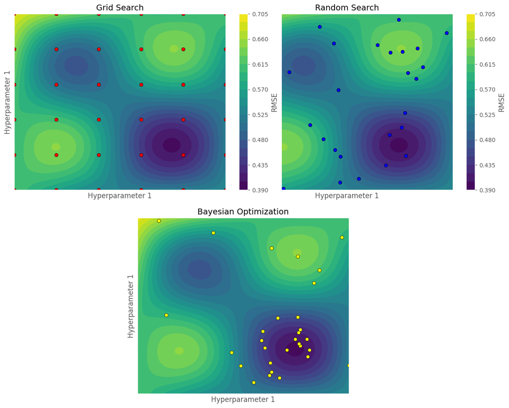

# Quick intro to Bayesian Optimization concepts

A **hyperparameter** is a parameter that characterizes a machine learning model. For example, in CatBoost, it could be the number of iterations, while in logistic regression, it could be the regularization factor. Although modern libraries often provide satisfactory default values, exploring other configurations is essential to optimize model performance. Hyperparameter tuning is therefore a central and recurring challenge in machine learning. However, this process is often perceived as "opaque" because it lacks systematic methods and heavily depends on experience and empirical rules [Snoek et al., 2012](https://doi.org/10.1007/s10994-012-5263-4).

Two common methods are used to select hyperparameters:

1. **Grid search**: This method involves defining fixed, discrete sets for each hyperparameter to explore, then training a model for every possible combination. For example, to optimize the learning rate and tree depth, the search space might be defined as:  
   `learning_rate ∈ [0.001, 0.004, 0.007, 0.009, 0.01]` and `tree_depth ∈ [2, 4, 8, 12, 14]`, yielding `5 × 5 = 25` combinations. Each combination is tested, and the one yielding the best performance on the test data is chosen. This approach is simple to implement but has a major drawback: its high computational cost, since all combinations must be evaluated, including very similar or poorly performing ones.

2. **Random search**: This method involves sampling a fixed number of combinations from defined probability distributions for each hyperparameter, instead of systematically exploring all combinations. For example, the learning rate could be sampled from `Uniform(0.001, 0.01)` and tree depth from a discrete uniform distribution `Uniform_discrete(2, 14)`, generating, for instance, 15 combinations to test. This method is also easy to implement, usually less costly than grid search, and allows more efficient exploration of large search spaces. However, since sampling is random and independent of previously observed performance, it may repeatedly test poorly performing regions of the search space.

Both of these hyperparameter optimization methods are popular and widely used. However, they share a common limitation: the information from previously evaluated combinations does not influence the choice of future trials. Intuitively, if certain regions of the hyperparameter space prove promising, it would make sense to explore them further. Conversely, repeatedly evaluating regions with low past performance is inefficient.

**Bayesian optimization** addresses this limitation. This approach iteratively searches for an optimized combination of hyperparameters using an **acquisition function**, which balances the trade-off between exploitation and exploration. Exploitation favors new combinations near those that have yielded good results, while exploration tests regions of the hyperparameter space that are less or not yet evaluated.

The figure below illustrates the impact of different hyperparameter search strategies on finding optimal performance. It shows a hypothetical RMSE as a function of two hyperparameters, with 30 sampled points displayed for each method. Dark blue areas represent low RMSE (low error), while yellow areas indicate high RMSE (high error).

- **Red points** represent combinations sampled by grid search. This method covers the space regularly but leads to many trials in poorly performing areas, even when neighboring points have shown unsatisfactory results.
- **Blue points** correspond to random search. It explores various parts of the space, sometimes finding points near the minimum. However, many trials are also conducted in poorly performing regions, reducing overall efficiency.
- **Yellow points** illustrate Bayesian optimization. This method starts with a global exploration to quickly identify the high-performance region. Sampling then concentrates around this area, explaining the high density of points near the global minimum. Bayesian optimization thus maximizes trials in promising areas while limiting unnecessary evaluations elsewhere.

  
*Figure 1: Illustration of hyperparameter tuning strategies. Dark blue areas indicate low RMSE, yellow areas indicate high RMSE.*

## How Bayesian Optimization Works

To achieve its goal, Bayesian optimization builds a probabilistic model of $f(\mathbf{x})$, the function to optimize. This function takes its inputs from the set $\mathcal{X} \subset \mathbb{R}^D$. At each iteration, the probabilistic model of $f(\mathbf{x})$ guides the search in $\mathcal{X}$, taking into account both the performance of previous iterations and regions of the search space with more or less uncertainty [Snoek et al., 2012](https://doi.org/10.1007/s10994-012-5263-4).

Bayesian optimization relies on two main choices [Snoek et al., 2012](https://doi.org/10.1007/s10994-012-5263-4): selecting a **surrogate model** to approximate the function to optimize and choosing an **acquisition function** $\alpha(\mathbf{x})$ to determine the next point to evaluate. **Gaussian processes** are frequently used as surrogate models due to their flexibility and ease of use, with a specified prior over $f(\mathbf{x})$.

In general, one iteration of Bayesian optimization proceeds as follows [distill](https://doi.org/10.1007/s10994-012-5263-4):

<ol>
<li>Select a surrogate model to approximate $f(\mathbf{x})$.</li>
<li>Using all previous evaluations $(\mathbf{x}, f(\mathbf{x}))$, apply Bayes' rule.</li>
<li>Use the acquisition function $\alpha(\mathbf{x})$ to select the next point $\mathbf{x}_{t+1}$ by solving:

$$
\mathbf{x}_{t+1} = \arg\max_{\mathbf{x} \in \mathcal{X}} \alpha(\mathbf{x})
$$

where $\mathcal{X}$ is the hyperparameter search space.
</li>
<li>Evaluate $f$ at $\mathbf{x}_{t+1}$ and add it to the history.</li>
</ol>

1. Select a surrogate model to approximate $f(\mathbf{x})$ and define a prior (e.g., a Gaussian process).
2. Using all previous evaluations, i.e., pairs $(\mathbf{x}, f(\mathbf{x}))$, apply Bayes' rule to obtain the posterior distribution.
3. Use the acquisition function $\alpha(\mathbf{x})$ to select the next point $\mathbf{x}_{t+1}$ to evaluate by solving:  

    $$
    \mathbf{x}_{t+1} = \arg\max_{\mathbf{x} \in \mathcal{X}} \alpha(\mathbf{x})
    $$

    where $\mathcal{X}$ is the hyperparameter search space.

4. Evaluate the function $f$ at $\mathbf{x}_{t+1}$ and add the observation $(\mathbf{x}_{t+1}, f(\mathbf{x}_{t+1}))$ to the history.
5. Repeat from step 2 until the stopping criterion (number of iterations or convergence) is reached.

### Common Acquisition Functions

Several acquisition functions exist to guide the choice of the next point to evaluate. Here, only the **Probability of Improvement (PI)** and **Expected Improvement (EI)** functions are discussed, as they are frequently used. For more information on other acquisition functions, see chapters 7 and 8 of [Garnett, 2023](#).  

For each of the acquisition functions explained below, it is assumed that the objective is to find the configuration $x$ that maximizes the given objective. Some notation elements are summarized in the table below:

| Element      | Interpretation                                                                 |
|-------------|-------------------------------------------------------------------------------|
| $x_{t+1}$ | Next point to evaluate                                                         |
| $f(x^+)$  | Best value achieved of the objective function (at point $x^+$)             |
| $\epsilon$| Small positive constant. Balances exploration and exploitation                |
| $\tau$    | Improvement threshold, calculated as $\tau = f(x^+) + \epsilon$             |

*Table 1: Notation elements for Bayesian optimization.*

#### Probability of Improvement $\alpha_{PI}(x)$

The **Probability of Improvement (PI)** corresponds to the probability that the function value $f(x)$ at a candidate point $x$ exceeds a certain threshold $\tau$. This threshold is usually defined as the sum of the best observed value $f(x^+)$ and an exploration-exploitation constant $\epsilon$ (i.e., $\tau = f(x^+) + \epsilon$), where a higher $\epsilon$ encourages exploration.  

The next point to evaluate, $x_{t+1}$, is the one that maximizes this probability. Mathematically ([Garnett, 2023](#), [Distill, 2020](#)):

$$
x_{t+1} = \arg\max_{\mathbf{x} \in \mathcal{X}} \alpha_{PI}(x)
          = \arg\max_{\mathbf{x} \in \mathcal{X}} \Pr[f(x) \geq \tau]
$$

Assuming a Gaussian process as the surrogate model, the Probability of Improvement can be written as:

$$
\alpha_{PI}(x) = \Phi\left(\frac{\mu - \tau}{\sigma}\right)
$$

where $\Phi$ denotes the cumulative distribution function of the standard normal distribution.  

Thus, the point $x_{t+1}$ to evaluate is chosen as the one maximizing this probability:

$$
x_{t+1} = \arg\max_{\mathbf{x} \in \mathcal{X}} \Phi\left(\frac{\mu - \tau}{\sigma}\right)
$$

To better understand how this function balances exploration and exploitation, a simplified version of $\alpha_{PI}(x)$ is considered, defined as $\alpha_{PI}'(x) = \frac{\mu - \tau}{\sigma}$. Examining the partial derivatives with respect to $\mu$ and $\sigma$, which are updated at each iteration, helps clarify their role. These derivatives are ([Garnett, 2023](#)):

$$
\frac{\partial \alpha_{PI}'(x)}{\partial \mu} = \frac{1}{\sigma} \qquad ; \qquad
\frac{\partial \alpha_{PI}'(x)}{\partial \sigma} = \frac{\tau - \mu}{\sigma^2}
$$

These derivatives can be interpreted as follows ([Garnett, 2023](#)):

- $\frac{\partial \alpha_{PI}'(x)}{\partial \mu} > 0$: the probability of improvement increases with $\mu$, which favors **exploitation**. In other words, points $x$ with high predicted values ($\mu$) are preferred.
- $\frac{\partial \alpha_{PI}'(x)}{\partial \sigma} > 0$ when $\tau > \mu$: the probability of improvement grows with uncertainty $\sigma$, encouraging **exploration** in regions with high predicted variance.
- $\frac{\partial \alpha_{PI}'(x)}{\partial \sigma} < 0$ when $\tau < \mu$: in this case, the probability of improvement decreases with uncertainty, which discourages exploration.

Thus, the Probability of Improvement tends to be relatively conservative: it favors "safe" solutions, i.e., certain but modest improvements, rather than riskier solutions that could yield larger but less certain gains ([Garnett, 2023](#)).

#### Expected Improvement $\alpha_{EI}(x)$

As explained in the previous section, the Probability of Improvement only considers the likelihood of an improvement, without taking into account its magnitude. The **Expected Improvement (EI)** function addresses this limitation by selecting the next point to explore as the one that maximizes the expected improvement over the threshold $\tau$, defined as the sum of the best observed point $f(x^+)$ and an exploration-exploitation constant $\epsilon$ ([Distill, 2020](#)).

For a Gaussian process used as the surrogate model, the Expected Improvement function is expressed using the cumulative distribution function $\Phi$ and the probability density function $\phi$ of the standard normal distribution ([Garnett, 2023](#)):

$$
\alpha_{EI}(x) =
\begin{cases}
(\mu - \tau)\,\Phi\left(\frac{\mu-\tau}{\sigma}\right) + \sigma\,\phi\left(\frac{\mu-\tau}{\sigma}\right) & \text{if } \sigma > 0\\[2mm]
\max(\mu - \tau, 0) & \text{if } \sigma = 0 \ (\text{degenerate case})
\end{cases}
$$

The value of $\alpha_{EI}(x)$ is high in two main situations (for $\sigma > 0$) ([Distill, 2020](#)):

1. When the expected value $(\mu - \tau)$ is high, via the first term $(\mu - \tau)\Phi\left(\frac{\mu-\tau}{\sigma}\right)$, which favors **exploitation** of already promising regions.
2. When the uncertainty $\sigma$ around a point is high, via the second term $\sigma\,\phi\left(\frac{\mu-\tau}{\sigma}\right)$, which favors **exploration** of new regions.

As with Probability of Improvement, the next point to explore is the one that maximizes $\alpha_{EI}(x)$:

$$
x_{t+1} = \arg\max_{\mathbf{x} \in \mathcal{X}} \alpha_{EI}(x)
$$
